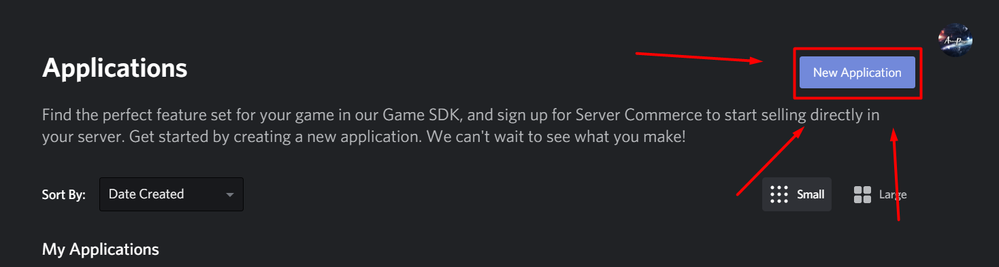
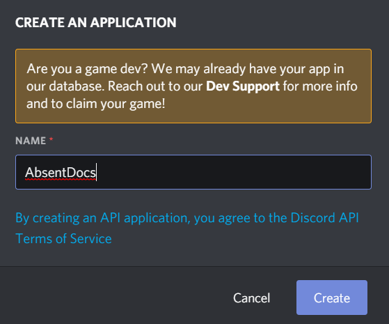

# Discord Bot Token

## What is a Discord Bot Token?

Discord Bot Token is a short phrase that acts as a “key” to controlling a Discord Bot. Tokens are used inside bot code to send commands back and forth to the API, which in turn controls bot actions.

## Getting Bot Token

Head over to [discord discord developer portal](https://discordapp.com/developers/applications). After that look on top right and click new application

