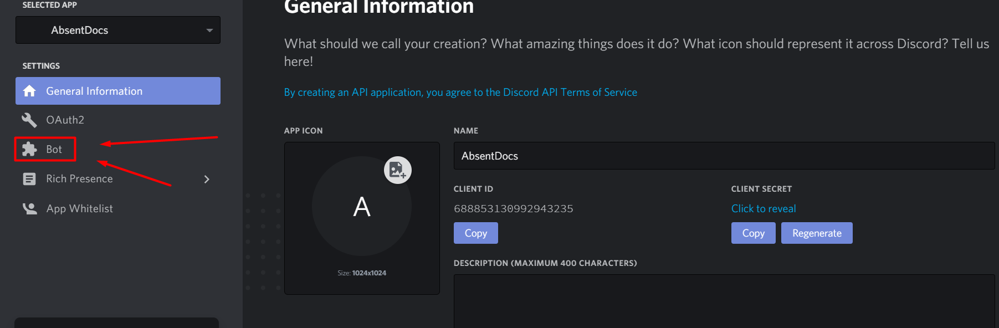
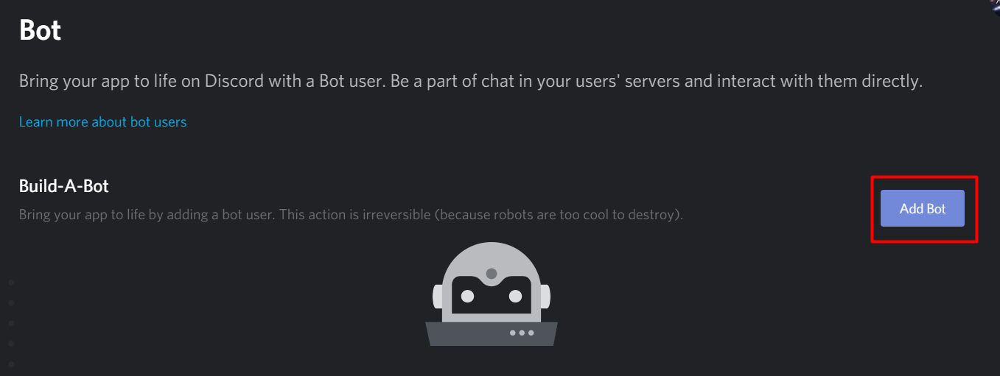
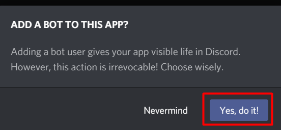
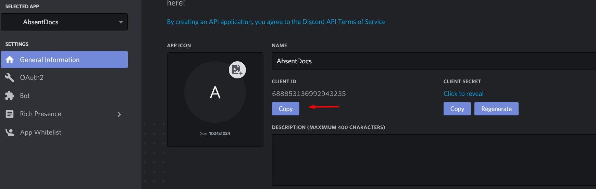
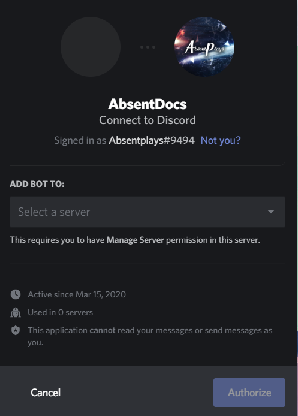
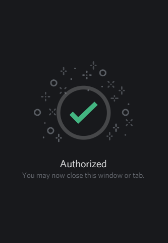

# Discord Bot Token

## What is a discord bot token?

Discord Bot Token is a short phrase that acts as a “key” to controlling a Discord Bot. Tokens are used inside bot code to send commands back and forth to the API, which in turn controls bot actions.

## Getting a bot token

Head over to [discord discord developer portal](https://discordapp.com/developers/applications). After that look on top right and click new application

## Making the Bot

Now lets head over to the bot page on the left hand side.

## Inviting the bot to your server

Lets get started on inviting your newly made discord bot to your discord server. First off you will need your client token to start off with and this link. [https://discordapp.com/oauth2/authorize?&client\_id=YOUR\_CLIENT\_ID\_HERE&scope=bot&permissions=0](https://discordapp.com/oauth2/authorize?&client_id=YOUR_CLIENT_ID_HERE&scope=bot&permissions=0)

Head over to "General Information" tab and get the client id.

Then head over to your internet browser and paste the link

